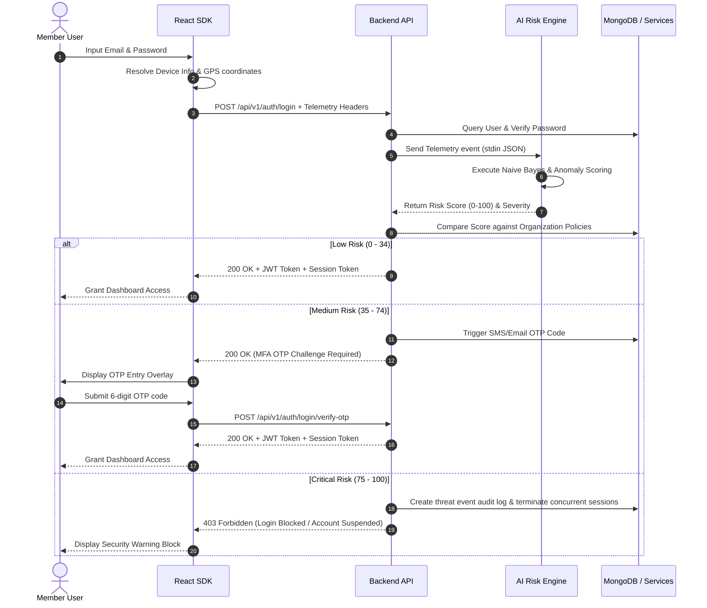

# MASC Security Platform Architecture

This document provides a detailed overview of the system architecture, component layout, and data-flow pathways of the **MASC Security Platform**. It is designed to help developers understand how the frontend applications, the React SDK components, the Express.js Backend API, and the FastAPI AI risk scoring engine coordinate to deliver real-time adaptive security.

---

## 🏗️ System Topology

MASC Security is structured as a decoupled, multi-layer service architecture. The platform consists of four primary blocks:

```
┌────────────────────────────────────────────────────────────────────────┐
│                          1. Frontend Clients                           │
│                                                                        │
│   ┌───────────────────────────┐            ┌───────────────────────┐   │
│   │    Administration Panel   │            │     Member Portal     │   │
│   │ (Configure policies, RBAC,│            │ (Self-service vault,  │   │
│   │  branding, dynamic fields)│            │  sessions, profile)   │   │
│   └───────────────────────────┘            └───────────────────────┘   │
└─────────────────────────────────────┬──────────────────────────────────┘
                                      │
                                      ▼
┌────────────────────────────────────────────────────────────────────────┐
│                        2. Frontend React SDK                           │
│                                                                        │
│   ┌───────────────────────────┐            ┌───────────────────────┐   │
│   │   Drop-In UI Components   │            │   Telemetry Interceptor│   │
│   │ (Login, Register, Portal) │            │  (Browser Fingerprints│   │
│   │                           │            │   & Geolocation API)  │   │
│   └─────────────┬─────────────┘            └───────────┬───────────┘   │
│                 │                                      │               │
│                 └───────────────────┬──────────────────┘               │
│                                     │                                  │
│                                     ▼                                  │
│                            ┌─────────────────┐                         │
│                            │    MascAuth &   │                         │
│                            │  Vault Client   │                         │
│                            └────────┬────────┘                         │
└─────────────────────────────────────┼──────────────────────────────────┘
                                      │ (HTTPS Requests with JWT/Signatures)
                                      ▼
┌────────────────────────────────────────────────────────────────────────┐
│                         3. Node.js Backend API                         │
│                                                                        │
│   ┌───────────────────────────┐            ┌───────────────────────┐   │
│   │     Auth / RBAC Router    │            │  Encrypted Vault Engine│   │
│   │   (JWT Issue, MFA OTP,    │            │  (AES-256-CBC envelope │   │
│   │    Dynamic field validation)           │   encryption handler) │   │
│   └─────────────┬─────────────┘            └───────────────────────┘   │
│                 │                                                      │
│                 │ (Passes Telemetry & Event Context)                   │
│                 ▼                                                      │
└─────────────────┼──────────────────────────────────────────────────────┘
                  │ (Spawns python subprocess / stdin)
                  ▼
┌────────────────────────────────────────────────────────────────────────┐
│                        4. Python AI Risk Engine                        │
│                                                                        │
│   ┌───────────────────────────┐            ┌───────────────────────┐   │
│   │     Naive Bayes Classifier│            │    Anomaly Detector   │   │
│   │  (Probabilistic telemetry │            │ (Isolation Forest /   │   │
│   │      weight analysis)     │            │ Euclidean Centroid)   │   │
│   └───────────────────────────┘            └───────────────────────┘   │
└────────────────────────────────────────────────────────────────────────┘
```

---

## 💾 Component Responsibilities

### 1. The Administration Panel & Member Portal
- **Administration Panel**: Written in React using vanilla CSS, it allows administrators to configure tenant branding, manage dynamic registration fields, set role permissions, review threat events flagged by the AI engine, and deploy security rules.
- **Member Portal**: The dashboard where individual members can view their active sessions, check their device profiles, manage and edit their personal profile fields, and access their private AES-256 encrypted vault.

### 2. Frontend React SDK (The Integration Layer)
Provides a bridge for third-party React applications to integrate with MASC.
- **UI Components**: Drop-in forms and widgets that handle styling, input validation, and verification states.
- **Authentication Hook (`useMascAuth`)**: Exposes current admin/user states, triggers OTP prompts, and synchronizes cross-tab sessions.
- **HMAC Vault Client (`MascDecryptedVaultClient`)**: Calculates HMAC signatures on payloads, enabling secure CRUD operations directly with the backend.

### 3. Node.js / Express.js Backend API
The central conductor for data access, auditing, and state control.
- **Middleware Boundary**: Evaluates JSON Web Tokens (JWT) for user sessions and inspects API headers (`x-signature`, `x-timestamp`, `x-nonce`) using SHA-256 HMAC for developer applications.
- **Enforcement Engine**: Evaluates dynamic registration/profile forms and intercepts user routing requests according to dynamic policy rules.
- **Vault Service**: Performs per-record cryptographic envelope operations, wrapping user payloads in AES-256-CBC, and stores ciphertext alongside audit trails.

### 4. Python FastAPI AI Risk Scoring Engine
Analyzes device, network, and environmental context during authentication events to estimate threat likelihood.
- **Naive Bayes Classifier**: Computes the posterior probability of compromise given device security status, network exposure (public/private), VPN usage, and known/unknown device status.
- **Isolation Forest / Anomaly Centroid**: Compares the incoming event vector against the user's historical normal login coordinates to determine spatial outliers.

---

## 🔒 Security Operations Flow

### 1. Authentication & Adaptive Multi-Factor Challenge
When a user submits login credentials through the SDK login component, the system triggers the **Adaptive Authentication** workflow:



### 2. Envelope Vault Encryption
Each record saved into the developer vault is protected with zero-knowledge capabilities using client/server collaboration:

1. **Vault Structure**: Vaults are partitioned by **Clusters** and **Collections**.
2. **Access Rules**: An administrator defines permission guidelines on collections (e.g., read, write, delete) and attaches them to Roles. 
3. **Encryption Pipeline**:
   - The user inputs raw JSON data.
   - The server draws a unique cryptographically random initialization vector (IV) and a user key.
   - The payload is encrypted using `AES-256-CBC` in the Node.js `crypto` runtime.
   - The ciphertext is stored in the database, meaning the raw content is unreadable without an authenticated user session context.
   - **Audit Logs**: Every read/write/delete operation is signed and logged with IP addresses, geographic location, and user-agents inside the `AuditLog` collection.

---

## 🌍 Global System States

The interaction between components is governed by key global flags and configuration profiles:
- **Setup Required**: Evaluated by the backend database at boot. If true, the frontend React app displays the `MascSetupWizard` to initialize database configurations and setup default administrator details.
- **Tenant Branding**: Admin configs are saved in the `Branding` collection. Upon mount, the React SDK retrieves these variables and overrides standard CSS Custom Properties (`--primary-start`, `--accent`, etc.) on `document.documentElement`, altering the style of all SDK components instantly.
- **Active Sessions**: Stored with location coordinates, VPN states, and IP ranges. If a user logs in from a suspicious IP or active session hijacking telemetry is detected (e.g., User-Agent switches mid-session), the middleware flags the request, returns `401 Unauthorized`, and prompts a global session teardown.
